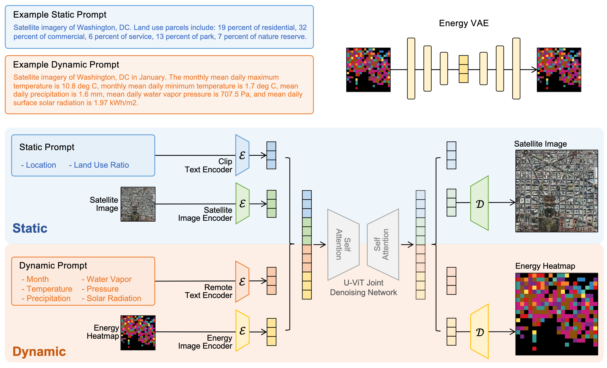
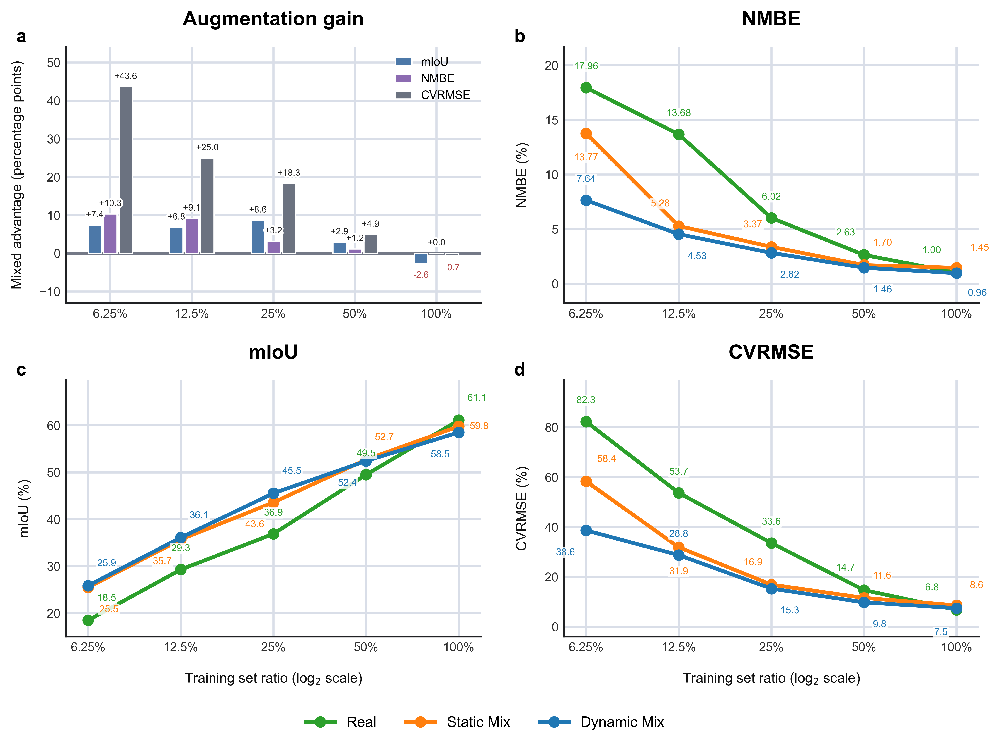

# DySENSE

## Introduction







## Installation

Download or clone the repository.

```shell
git clone https://github.com/kailaisun/DySENSE.git
cd DySENSE
```

### Environment Installation 
We recommend using Conda ([Miniconda](https://docs.conda.io/projects/miniconda/en/latest/index.html)) for installation. 

Please refer to the [UrbanControlnet](https://github.com/kailaisun/UrbanControlNet).

Then install the Python dependencies of this repository:

```shell
pip install -r requirements.txt
```


### Model download
We make our trained model public at: https://huggingface.co/skl24/DySENSE/

## Dataset Preparation

The dataset is built from publicly available global sources:
- **Urban boundaries** — [GHS Urban Centre Database (2023)](https://human-settlement.emergency.copernicus.eu/ghs_ucdb_2024.php), covering 500 metropolitan areas with 400 m × 400 m grids.
- **Satellite imagery** — [Mapbox Static Tiles API](https://docs.mapbox.com/api/maps/static-tiles/).
- **Population and building data** — GHSL P2023A (2020): [GHS-BUILT-S](https://developers.google.com/earth-engine/datasets/catalog/JRC_GHSL_P2023A_GHS_BUILT_S), [GHS-BUILT-V](https://human-settlement.emergency.copernicus.eu/ghs_buV2023.php), [GHS-POP](https://human-settlement.emergency.copernicus.eu/ghs_pop2019.php).
- **Environmental constraints** — [OpenStreetMap](https://www.openstreetmap.org), including major roads, water bodies, and railways.


#### Dataset Download

Download [MUSE2](https://huggingface.co/datasets/skl24/MUSE2) and place it at `data/MUSE2`, so that the JSONL splits are available under `data/MUSE2/mixed_json_class10_july/`.


## Training and generation

Stage commands are wrapped in [`scripts/`](scripts) (edit paths/flags there).

Download RemoteCLIP ViT-L/14 text encoder:

```shell
bash scripts/download_remoteclip.sh
```

**Stage 0 — Build the initial pipeline:**

```shell
bash scripts/build_pipeline.sh
```

**Stage 1 — Train the Energy VAE:**

```shell
bash scripts/train_energy_vae.sh
```

**Stage 2 — Train the joint diffusion model:**

```shell
bash scripts/train_joint_diffusion.sh
```

**Stage 3 — Dynamic generation:**

```shell
bash scripts/generate_dynamic.sh
```

**Optional — Static generation:**

```shell
bash scripts/generate_static.sh
```

**Stage 4 — Downstream energy prediction:**

```shell
bash scripts/install_mmseg.sh              # mmsegmentation toolchain
bash scripts/prepare_downstream_data.sh    # MMSeg-layout data from MUSE2
bash scripts/train_strategy_a.sh           # A: real only
bash scripts/train_strategy_b.sh           # B: real + synthetic
bash scripts/train_strategy_c.sh           # C: synthetic only
```

## Model evaluation

For computing metric (e.g., FID, SSIM, FSIM, PSNR, etc.), please see our another repo: [Evaluation-Metrics](https://github.com/T5-AI/Evaluation-Metrics)

## Acknowledgements

This research is supported by the National Research Foundation (NRF), Prime Minister's Office under its Campus for Research Excellence and Technological Enterprise (CREATE) programme.
The Mens, Manus, and Machina (M3S) is an interdisciplinary research group (IRG) of the Massachusetts Institute of Technology and the Singapore MIT Alliance for Research and Technology (SMART) centre.

## Citation

```bibtex
@article{dysense,
  title  = {DySENSE: Dynamic Spatiotemporal ENergy Synthesis and Emulation with Satellite Imagery},
  author = {Sun, Kailai and Gao, Zijie and He, Mingyi and Rong, Can and Prakash, Alok and Guo, Baoshen and Wang, Shenhao and Zhao, Jinhua},
  note   = {Under review},
  year   = {2026}
}
```

## License

The repository is licensed under the [Apache 2.0 license](LICENSE).

## Contact Us

If you have other questions❓, please contact us in time 👬
